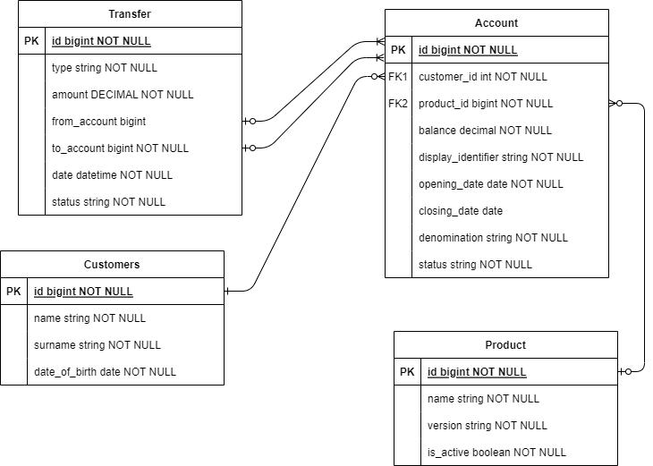

# Simon-Bank-App
To you can install project with docker.

To run project open main project folder and run command:
```
docker-compose -f docker-compose.yml up
```
and then open in you browser: 
```
localhost:80
```
### Entity diagram:

